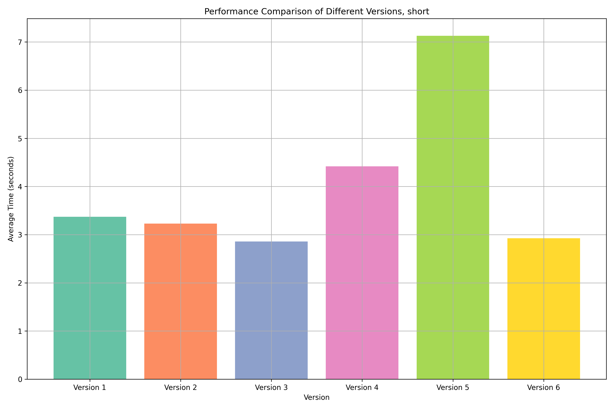
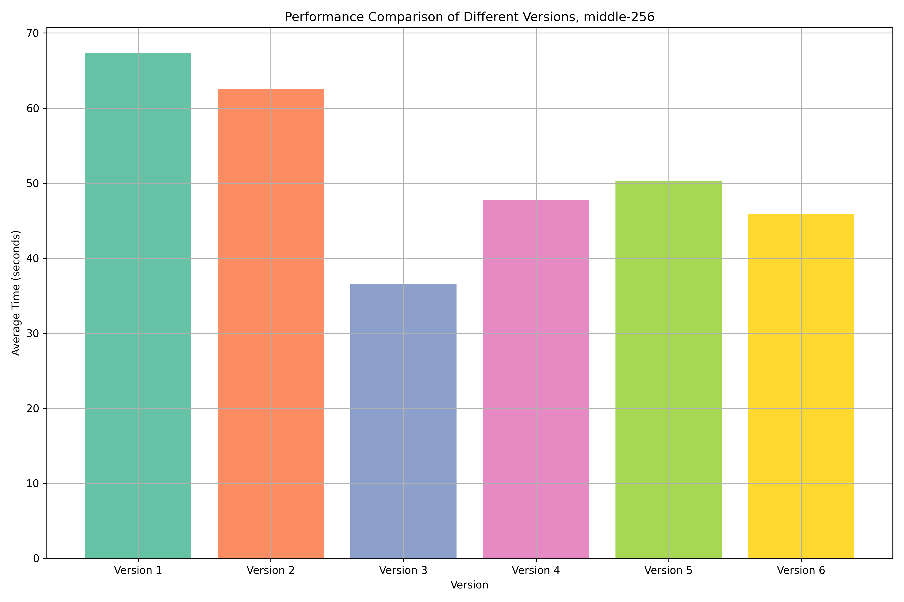
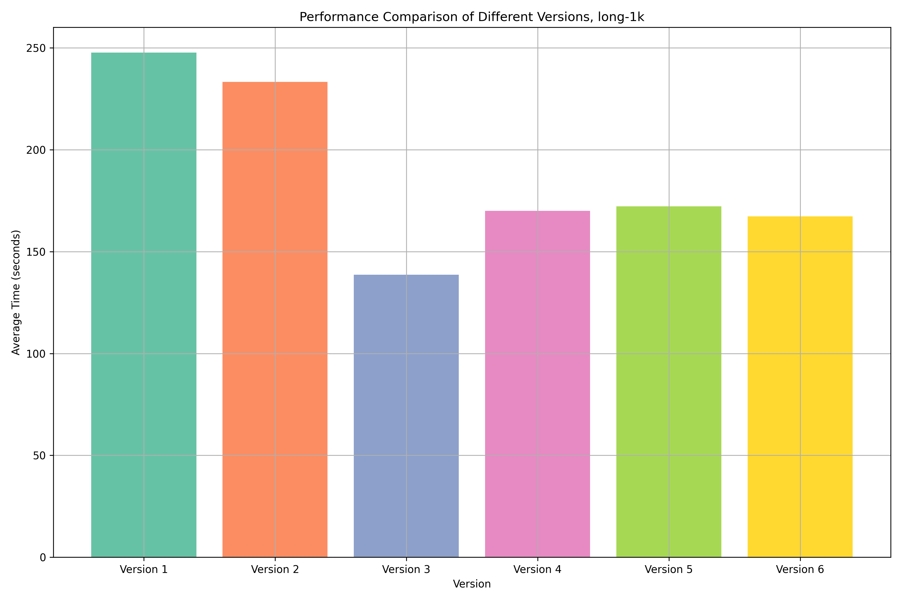
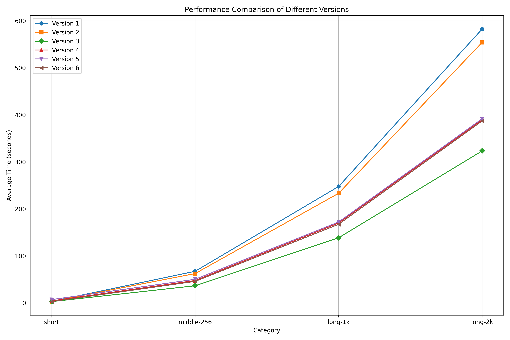
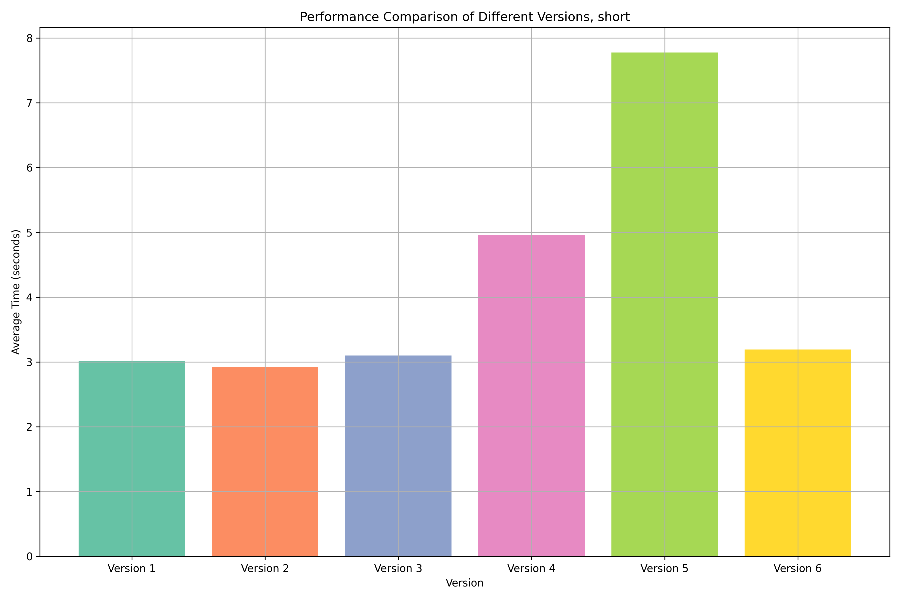
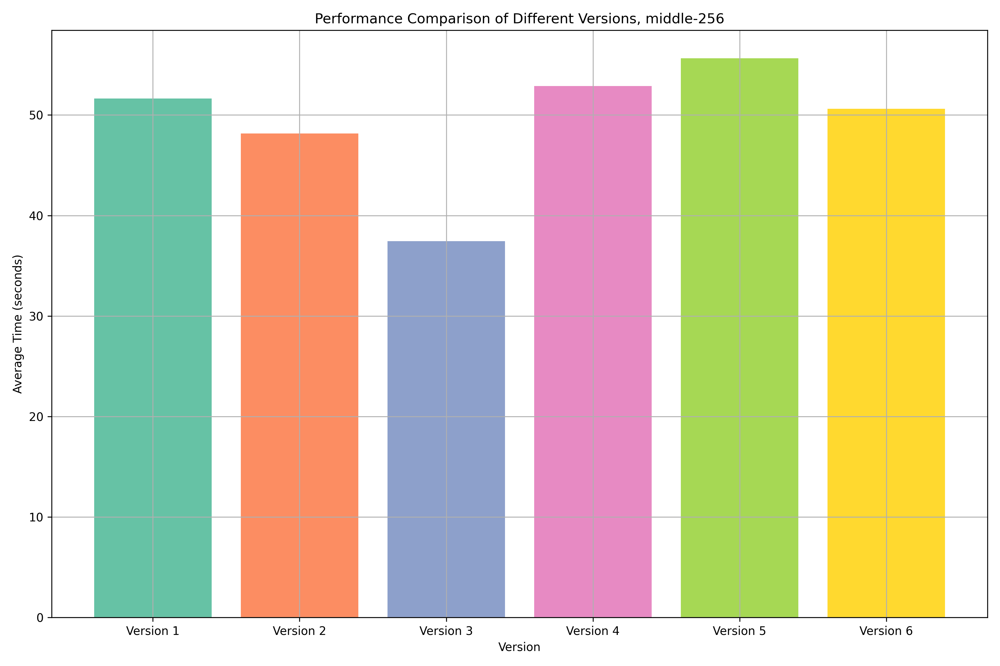
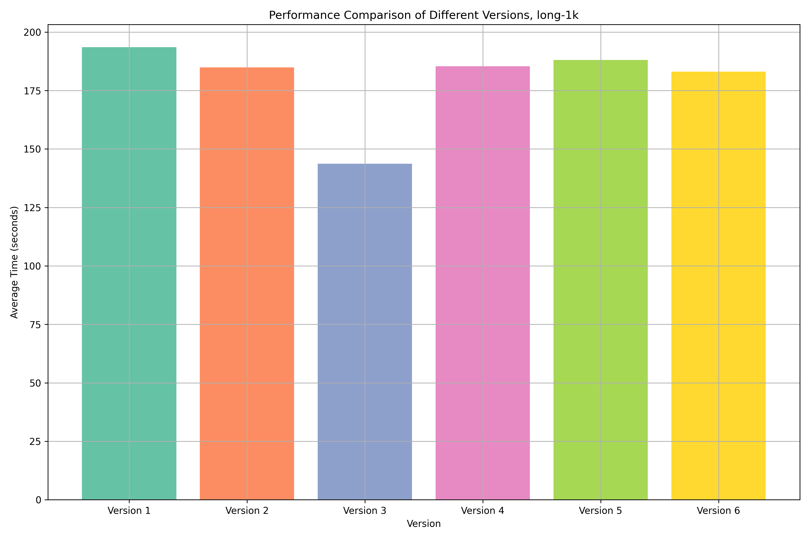
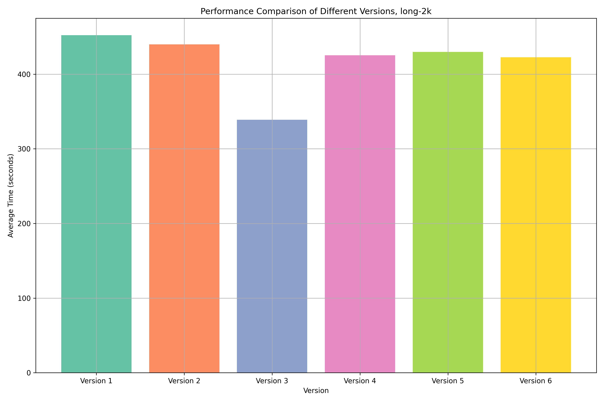
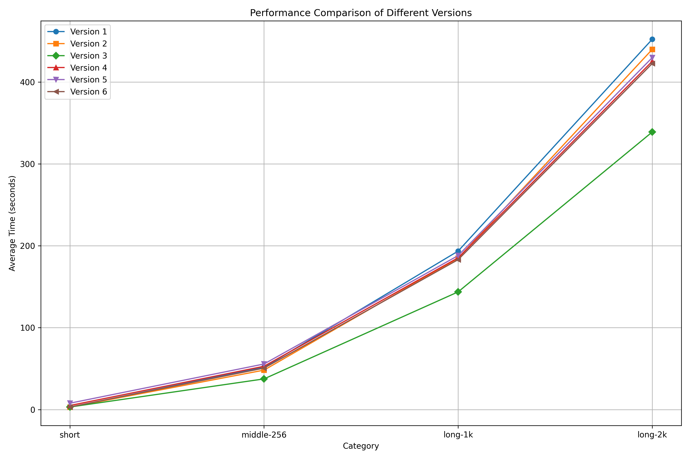

# Optimizing Performance: Python Speed Test for Digit Search in Strings

⛓️ In response to the original post: [Read the discussion here](https://lnkd.in/e56KKsMp).

🪜 I conducted an experiment to evaluate the efficiency of different Python methods for searching digits within strings, considering various string lengths from short to long. Below, I compare six different techniques and their strengths in extracting digits.

## Categories for Testing

The strings were categorized into four distinct groups based on their lengths:

- **Short**: A brief string containing only a few characters.
- **Middle**: A moderately sized string, about 256 characters.
- **Long (1KB)**: A longer string, roughly 1 kilobyte, simulating paragraphs of text.
- **Long (2KB)**: A significantly large string of about 2 kilobytes, suitable for document-like data.

**Test enviroment**: macOS Sonoma 14.7.1, MacBook Air 13", 2019, Intel i5 1.6Ghz 2-Core.

## Methods Compared

Below are the six versions of digit extraction methods, each analyzed based on performance:

### 1. **Version 1: Manual Iteration with List and `isdigit()`**
   - **Description**: Iterates through each character of the string, checks if it's a digit with `char.isdigit()`, and appends it to a list.
   - **Performance**:
     - **Short**: 3.37 seconds
     - **Middle**: 1.12 minutes
     - **Long (1KB)**: 4.13 minutes
     - **Long (2KB)**: 9.71 minutes

### 2. **Version 2: List Comprehension with `isdigit()`**
   - **Description**: Uses a list comprehension to filter digits, creating a list of digits in a single line using `char.isdigit()`.
   - **Performance**:
     - **Short**: 3.23 seconds
     - **Middle**: 1.04 minutes
     - **Long (1KB)**: 3.89 minutes
     - **Long (2KB)**: 9.24 minutes

### 3. **Version 3: `filter` with `str.isdigit`**
   - **Description**: Uses the `filter` function with `str.isdigit`, which directly filters out non-digit characters and returns a filtered iterator.
   - **Performance**:
     - **Short**: **2.86 seconds** (Fastest)
     - **Middle**: **36.56 seconds** (Fastest)
     - **Long (1KB)**: **2.31 minutes** (Fastest)
     - **Long (2KB)**: **5.39 minutes** (Fastest)

### 4. **Version 4: Regular Expression with `re.findall`**
   - **Description**: Uses a regular expression (`\d+`) to find all digit sequences in the string, returning a list of matches.
   - **Performance**:
     - **Short**: 4.42 seconds
     - **Middle**: 47.71 seconds
     - **Long (1KB)**: 2.83 minutes
     - **Long (2KB)**: 6.49 minutes

### 5. **Version 5: Precompiled Regular Expression with `re.findall`**
   - **Description**: Utilizes a precompiled regex pattern (`re.compile`) for repeated digit searches with `re.findall`, aiming for faster execution with compiled patterns.
   - **Performance**:
     - **Short**: 7.13 seconds
     - **Middle**: 50.33 seconds
     - **Long (1KB)**: 2.87 minutes
     - **Long (2KB)**: 6.53 minutes

### 6. **Version 6: Precompiled Regex with `.findall` Method**
   - **Description**: Uses a precompiled regex pattern (`re.compile`) and its `.findall()` method directly on the string to extract all digit sequences.
   - **Performance**:
     - **Short**: 2.93 seconds
     - **Middle**: 45.87 seconds
     - **Long (1KB)**: 2.79 minutes
     - **Long (2KB)**: 6.45 minutes

## Final Recommendation

- **Best Method**: **Version 3** (`filter` with `str.isdigit`) is the clear winner across all measures.
- **Why**: It is simple, readable, and performs exceptionally well for both small and large datasets.


## Result 

### Output 3.13.0

```
% python main.py
Darwin_3.13.0, times=5000000, repeat=3

Category: 'short'
 - Version 1. Time: ['3.4180', '3.3468', '3.3461'] avg: 3.3703 seconds. Result: 2024
 - Version 2. Time: ['3.2680', '3.1936', '3.2276'] avg: 3.2297 seconds. Result: 2024
 - Version 3. Time: ['2.8397', '2.8754', '2.8645'] avg: 2.8599 seconds. Result: 2024
 - Version 4. Time: ['4.3639', '4.4486', '4.4417'] avg: 4.4181 seconds. Result: 2024
 - Version 5. Time: ['7.0495', '7.1414', '7.1971'] avg: 7.1293 seconds. Result: 2024
 - Version 6. Time: ['2.9280', '2.9187', '2.9319'] avg: 2.9262 seconds. Result: 2024

Category: 'middle-256'
 - Version 1. Time: ['67.3783', '67.6979', '67.0671'] avg: 67.3811 seconds. Result: 202420240220240001202406151372024091043215672024122233
 - Version 2. Time: ['62.9530', '62.5314', '62.0876'] avg: 62.5240 seconds. Result: 202420240220240001202406151372024091043215672024122233
 - Version 3. Time: ['36.7012', '36.5057', '36.4587'] avg: 36.5552 seconds. Result: 202420240220240001202406151372024091043215672024122233
 - Version 4. Time: ['47.7360', '47.7376', '47.6681'] avg: 47.7139 seconds. Result: 202420240220240001202406151372024091043215672024122233
 - Version 5. Time: ['50.3733', '50.3510', '50.2714'] avg: 50.3319 seconds. Result: 202420240220240001202406151372024091043215672024122233
 - Version 6. Time: ['45.8516', '45.9222', '45.8223'] avg: 45.8654 seconds. Result: 202420240220240001202406151372024091043215672024122233

Category: 'long-1k'
 - Version 1. Time: ['247.6524', '247.7653', '247.7344'] avg: 247.7174 seconds. Result: 202420240101202412312024021520240310110012024202401202024202406302565678202420240705303506020240915789001232024080120241031202411052024121541252024998020242024123020251
 - Version 2. Time: ['232.9952', '233.0520', '233.8286'] avg: 233.2919 seconds. Result: 202420240101202412312024021520240310110012024202401202024202406302565678202420240705303506020240915789001232024080120241031202411052024121541252024998020242024123020251
 - Version 3. Time: ['138.3953', '138.7282', '138.7134'] avg: 138.6123 seconds. Result: 202420240101202412312024021520240310110012024202401202024202406302565678202420240705303506020240915789001232024080120241031202411052024121541252024998020242024123020251
 - Version 4. Time: ['170.0998', '170.4189', '169.5901'] avg: 170.0362 seconds. Result: 202420240101202412312024021520240310110012024202401202024202406302565678202420240705303506020240915789001232024080120241031202411052024121541252024998020242024123020251
 - Version 5. Time: ['172.2324', '172.1944', '172.1929'] avg: 172.2066 seconds. Result: 202420240101202412312024021520240310110012024202401202024202406302565678202420240705303506020240915789001232024080120241031202411052024121541252024998020242024123020251
 - Version 6. Time: ['167.4107', '167.2363', '167.1903'] avg: 167.2791 seconds. Result: 202420240101202412312024021520240310110012024202401202024202406302565678202420240705303506020240915789001232024080120241031202411052024121541252024998020242024123020251

Category: 'long-2k'
 - Version 1. Time: ['582.2415', '582.9876', '582.5370'] avg: 582.5887 seconds. Result: 202420242024010510012024020120240331202404151002244202405202024061015334562024070178912345567899882024080120240915202430352024100578902002024092520241015202410202108765202411012024112099013456202420241125654343212024121030020241220202501312025021020252024
 - Version 2. Time: ['553.1481', '554.6678', '554.9689'] avg: 554.2616 seconds. Result: 202420242024010510012024020120240331202404151002244202405202024061015334562024070178912345567899882024080120240915202430352024100578902002024092520241015202410202108765202411012024112099013456202420241125654343212024121030020241220202501312025021020252024
 - Version 3. Time: ['323.2028', '323.5094', '323.4390'] avg: 323.3837 seconds. Result: 202420242024010510012024020120240331202404151002244202405202024061015334562024070178912345567899882024080120240915202430352024100578902002024092520241015202410202108765202411012024112099013456202420241125654343212024121030020241220202501312025021020252024
 - Version 4. Time: ['390.0178', '388.7353', '389.5589'] avg: 389.4373 seconds. Result: 202420242024010510012024020120240331202404151002244202405202024061015334562024070178912345567899882024080120240915202430352024100578902002024092520241015202410202108765202411012024112099013456202420241125654343212024121030020241220202501312025021020252024
 - Version 5. Time: ['391.7042', '391.4870', '392.1666'] avg: 391.7859 seconds. Result: 202420242024010510012024020120240331202404151002244202405202024061015334562024070178912345567899882024080120240915202430352024100578902002024092520241015202410202108765202411012024112099013456202420241125654343212024121030020241220202501312025021020252024
 - Version 6. Time: ['386.7376', '387.3923', '387.0871'] avg: 387.0723 seconds. Result: 202420242024010510012024020120240331202404151002244202405202024061015334562024070178912345567899882024080120240915202430352024100578902002024092520241015202410202108765202411012024112099013456202420241125654343212024121030020241220202501312025021020252024

```

### Diagrams 3.13.0
#### Catergory: Short


#### Catergory: Middle 256


#### Catergory: Long 1K


#### Catergory: Long 2K


#### All Catergories



### CSV of duration 3.13.0
| Function | short | middle-256 | long-1k  | long-2k  |
|---------|-------|------------|----------|----------|
| Version 1 | 3.37 s | 1.12 m | 4.13 m | 9.71 m |
| Version 2 | 3.23 s | 1.04 m | 3.89 m | 9.24 m |
| Version 3 | 2.86 s | 36.56 s | 2.31 m | 5.39 m |
| Version 4 | 4.42 s | 47.71 s | 2.83 m | 6.49 m |
| Version 5 | 7.13 s | 50.33 s | 2.87 m | 6.53 m |
| Version 6 | 2.93 s | 45.87 s | 2.79 m | 6.45 m |

### Output 3.12.5

```
Darwin_3.12.5, times=5000000, repeat=3

Category: 'short'
 - Version 1. Time: ['2.9517', '3.0429', '3.0487'] avg: 3.0145 seconds. Result: 2024
 - Version 2. Time: ['2.8830', '2.9287', '2.9667'] avg: 2.9261 seconds. Result: 2024
 - Version 3. Time: ['3.0575', '3.1010', '3.1405'] avg: 3.0996 seconds. Result: 2024
 - Version 4. Time: ['4.9362', '4.9749', '4.9666'] avg: 4.9593 seconds. Result: 2024
 - Version 5. Time: ['7.7658', '7.8159', '7.7501'] avg: 7.7773 seconds. Result: 2024
 - Version 6. Time: ['3.2146', '3.1668', '3.1991'] avg: 3.1935 seconds. Result: 2024

Category: 'middle-256'
 - Version 1. Time: ['51.9282', '51.6397', '51.3871'] avg: 51.6517 seconds. Result: 202420240220240001202406151372024091043215672024122233
 - Version 2. Time: ['48.3450', '48.2804', '47.8396'] avg: 48.1550 seconds. Result: 202420240220240001202406151372024091043215672024122233
 - Version 3. Time: ['37.6521', '37.4220', '37.2507'] avg: 37.4416 seconds. Result: 202420240220240001202406151372024091043215672024122233
 - Version 4. Time: ['52.4552', '52.4467', '53.7511'] avg: 52.8843 seconds. Result: 202420240220240001202406151372024091043215672024122233
 - Version 5. Time: ['55.7951', '55.6579', '55.4942'] avg: 55.6491 seconds. Result: 202420240220240001202406151372024091043215672024122233
 - Version 6. Time: ['50.7412', '50.5648', '50.5219'] avg: 50.6093 seconds. Result: 202420240220240001202406151372024091043215672024122233

Category: 'long-1k'
 - Version 1. Time: ['193.6200', '193.6183', '193.4304'] avg: 193.5563 seconds. Result: 202420240101202412312024021520240310110012024202401202024202406302565678202420240705303506020240915789001232024080120241031202411052024121541252024998020242024123020251
 - Version 2. Time: ['184.7017', '184.9576', '184.8794'] avg: 184.8462 seconds. Result: 202420240101202412312024021520240310110012024202401202024202406302565678202420240705303506020240915789001232024080120241031202411052024121541252024998020242024123020251
 - Version 3. Time: ['143.4618', '144.0426', '143.6542'] avg: 143.7195 seconds. Result: 202420240101202412312024021520240310110012024202401202024202406302565678202420240705303506020240915789001232024080120241031202411052024121541252024998020242024123020251
 - Version 4. Time: ['185.4539', '185.3935', '185.1916'] avg: 185.3463 seconds. Result: 202420240101202412312024021520240310110012024202401202024202406302565678202420240705303506020240915789001232024080120241031202411052024121541252024998020242024123020251
 - Version 5. Time: ['188.0466', '188.0540', '188.0219'] avg: 188.0408 seconds. Result: 202420240101202412312024021520240310110012024202401202024202406302565678202420240705303506020240915789001232024080120241031202411052024121541252024998020242024123020251
 - Version 6. Time: ['183.0597', '183.0728', '183.1034'] avg: 183.0786 seconds. Result: 202420240101202412312024021520240310110012024202401202024202406302565678202420240705303506020240915789001232024080120241031202411052024121541252024998020242024123020251

Category: 'long-2k'
 - Version 1. Time: ['452.1694', '452.5657', '452.0116'] avg: 452.2489 seconds. Result: 202420242024010510012024020120240331202404151002244202405202024061015334562024070178912345567899882024080120240915202430352024100578902002024092520241015202410202108765202411012024112099013456202420241125654343212024121030020241220202501312025021020252024
 - Version 2. Time: ['439.8947', '440.0354', '439.8001'] avg: 439.9100 seconds. Result: 202420242024010510012024020120240331202404151002244202405202024061015334562024070178912345567899882024080120240915202430352024100578902002024092520241015202410202108765202411012024112099013456202420241125654343212024121030020241220202501312025021020252024
 - Version 3. Time: ['338.8941', '339.2528', '338.7685'] avg: 338.9718 seconds. Result: 202420242024010510012024020120240331202404151002244202405202024061015334562024070178912345567899882024080120240915202430352024100578902002024092520241015202410202108765202411012024112099013456202420241125654343212024121030020241220202501312025021020252024
 - Version 4. Time: ['425.2360', '425.1609', '425.5966'] avg: 425.3312 seconds. Result: 202420242024010510012024020120240331202404151002244202405202024061015334562024070178912345567899882024080120240915202430352024100578902002024092520241015202410202108765202411012024112099013456202420241125654343212024121030020241220202501312025021020252024
 - Version 5. Time: ['429.8242', '430.1032', '429.5736'] avg: 429.8336 seconds. Result: 202420242024010510012024020120240331202404151002244202405202024061015334562024070178912345567899882024080120240915202430352024100578902002024092520241015202410202108765202411012024112099013456202420241125654343212024121030020241220202501312025021020252024
 - Version 6. Time: ['422.7228', '422.6368', '422.4690'] avg: 422.6095 seconds. Result: 202420242024010510012024020120240331202404151002244202405202024061015334562024070178912345567899882024080120240915202430352024100578902002024092520241015202410202108765202411012024112099013456202420241125654343212024121030020241220202501312025021020252024
```

### Diagrams 3.12.5
#### Catergory: Short


#### Catergory: Middle 256


#### Catergory: Long 1K


#### Catergory: Long 2K


#### All Catergories


### Compare CSV

#### Function Duration Metrics in Python 3.12.5

| Function | short | middle-256 | long-1k  | long-2k  |
|---------|-------|------------|----------|----------|
| Version 1 | 3.01 s | 51.65 s | 3.22 m | 7.54 m |
| Version 2 | **2.93 s** | 48.15 s | 3.08 m | 7.33 m |
| Version 3 | 3.10 s | **37.44 s** | **2.40 m** | **5.66 m** |
| Version 4 | 4.96 s | 52.88 s | 3.08 m | 7.05 m |
| Version 5 | 7.78 s | 55.65 s | 3.13 m | 7.17 m |
| Version 6 | 3.19 s | 50.61 s | 3.04 m | 7.04 m |

#### Function Duration Metrics in Python 3.13.0
| Function | short | middle-256 | long-1k  | long-2k  |
|---------|-------|------------|----------|----------|
| Version 1 | 3.37 s | 1.12 m | 4.13 m | 9.71 m |
| Version 2 | 3.23 s | 1.04 m | 3.89 m | 9.24 m |
| Version 3 | **2.86 s** | **36.56 s** | **2.31 m** | **5.39 m** |
| Version 4 | 4.42 s | 47.71 s | 2.83 m | 6.49 m |
| Version 5 | 7.13 s | 50.33 s | 2.87 m | 6.53 m |
| Version 6 | 2.93 s | 45.87 s | 2.79 m | 6.45 m |

#### CSV of Function Duration Differences (%) Between Python 3.13.0 and 3.12.5

| Function | short | middle-256 | long-1k  | long-2k  |
|---------|-------|------------|----------|----------|
| Version 1 | 11.96% | 29.44% | 28.21% | 28.78% |
| Version 2 | 9.27% | 30.79% | 26.60% | 26.46% |
| Version 3 | **-7.74%** | 2.36% | **-3.75%** | **-4.77%** |
| Version 4 | **-10.89%** | 9.78% | 8.12% | 7.95% |
| Version 5 | **-8.36%** | 9.56% | 8.30% | 8.93% |
| Version 6 | **-8.15%** | 9.33% | 8.22% | 8.39% |